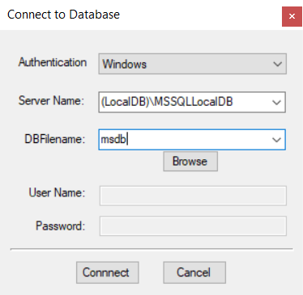
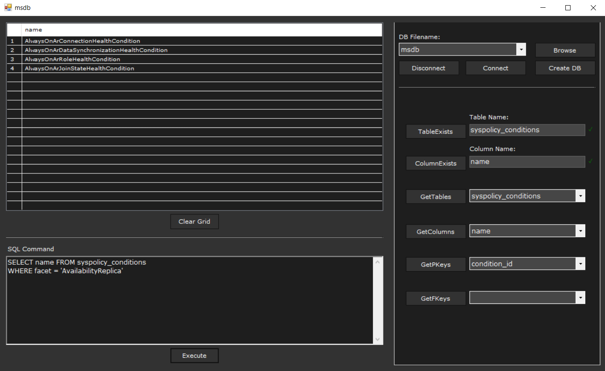

# dbClient
A VB.NET client for connecting to and handling an SQL database, implemented in Visual Studio as part of my 4th semester Database Systems course project.
You can connect to either SQL Server (requires credentials) or local database and explore it or execute SQL queries

### Some screenshots

Connection form: \

Main screen: \

